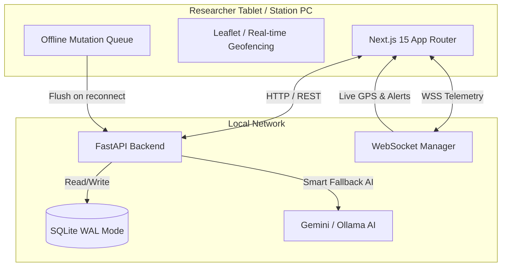

<div align="center">
  
# ❄️ PRAHARI
### Antarctic Logistics & Safety Intelligence Platform

[](https://nextjs.org/)
[](https://fastapi.tiangolo.com/)
[](https://sqlite.org/)
[](https://tailwindcss.com/)
[](https://sih.gov.in/)

*Built by **Team 36 OURS** for the extreme edge of the world.*

</div>

---

## 🧊 The Challenge: SIH26062
Antarctic research stations (Maitri, Bharati, Himadri) operate in the harshest environments on Earth. Traditional logistics systems fail here because they rely on constant cloud connectivity, fragile sensors, and fragmented data silos. When a blizzard hits and the satellite uplink dies, researchers are left blind.

## 🛡️ The Solution: Prahari
**Prahari** (Hindi for *Sentinel*) is a military-grade, offline-first command center. It abandons brittle cloud dependencies in favor of a hyper-resilient local architecture. It unifies expedition planning, cargo tracking, dynamic inventory depletion, personnel GPS routing, and emergency accountability into a **single source of truth**.

### 🔥 Next-Level Engineering Decisions
- **True Offline-First Mutex**: When comms go dark, Prahari queues all mutations locally. When the uplink is restored, it flushes the queue deterministically. Operations never stop.
- **Deterministic SQL > AI Hallucinations**: We use a **Smart Fallback AI** (Gemini 1.5 Flash → Ollama Llama 3.2 → Regex) to parse natural language requests, but rely on **hard SQL aggregates** for life-or-death inventory counts. No RAG approximations. No vector hallucinations.
- **Level-H QR Resilience**: Cargo QR codes are generated with Level-H (30%) error correction, guaranteeing scanability even if the physical label is heavily frosted, torn, or partially obscured.
- **SQLite WAL Concurrency**: Configured SQLite with `PRAGMA journal_mode=WAL` and `busy_timeout=5000` to handle hundreds of concurrent WebSocket telemetry streams without database locking.

---

## 🏗️ System Architecture



---

## 🌌 The 5 Core Modules

1. **🗺️ Expedition Planning**: 
   Commander inputs natural language -> Smart Fallback AI (Gemini 1.5 Flash → Ollama → Regex) parses logistics -> Feasibility Engine calculates Readiness Score based on live personnel, fuel, and station capacity.
2. **📦 Cargo Tracking**: 
   QR-driven supply chain tracking. Simulates Blizzard `ΔT` to dynamically update shipment risk scores and ETAs.
3. **🔋 Dynamic Inventory**: 
   Tracks fuel, rations, and medical supplies using algorithmic depletion curves: 
   `days_of_cover = quantity / (base_burn_rate * (1 + beta * delta_T))`
4. **📍 Personnel Routing**: 
   Live WebSocket GPS tracking with SQLite WAL persistence. Generates multi-node movement plans and automatically triggers geofence violations if researchers stray into crevasses.
5. **🚨 Emergency Accountability**: 
   One-click SOS. Instantly computes Haversine distances to locate the nearest emergency assets (snowcats, medical sleds) and tallies live accountability metrics.

---

## ⚡ Quick Start (Local Demo)

Prahari requires zero cloud dependencies (but gracefully uses them if available).

### 1. Configure the Environment
Create a `.env` file in the `backend` directory:
```env
GEMINI_API_KEY=your_google_ai_studio_key  # Optional: Fallbacks to Ollama or regex if omitted
PRAHARI_API_KEY=your_commander_key
PRAHARI_ALLOW_DEMO_KEY=true               # Optional: only for local demo usage
```
Create a `.env.local` file in the `frontend` directory:
```env
NEXT_PUBLIC_COMMANDER_KEY=your_commander_key
```
`NEXT_PUBLIC_COMMANDER_KEY` is browser-visible and intended only for local/demo environments. Use real user/server-side auth for production deployments.

### 2. Boot the Station Backend
```bash
cd backend
pip install -r requirements.txt
python -m uvicorn app.main:app --reload --host 0.0.0.0 --port 8000 --env-file .env
```

### 3. Boot the Edge Frontend
```bash
cd frontend
npm install
npm run dev
```

### 4. Experience the Live Scenario
Open `http://localhost:3000/scenario` in your browser. 
We built a **fully scripted, interactive scenario runner** specifically for the judges. It walks through a complete end-to-end Antarctic operation—from AI expedition planning to a live GPS geofence violation—proving the integration of all 5 modules in real-time.

---
<div align="center">
  <i>"In Antarctica, logistics isn't a spreadsheet. It's survival."</i><br>
  <b>— Team 36 OURS</b>
</div>
