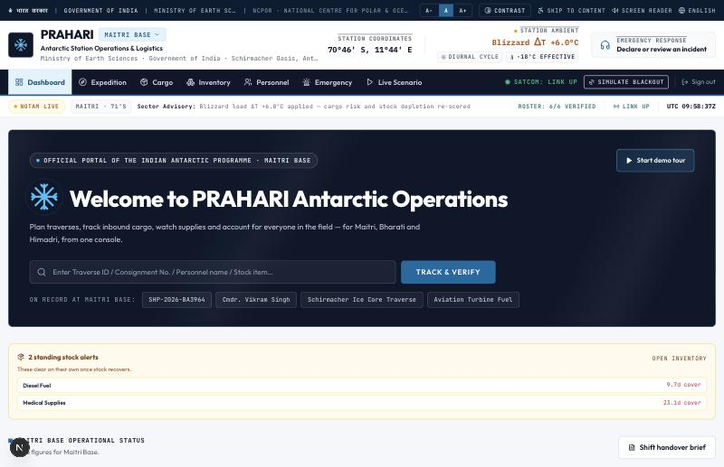
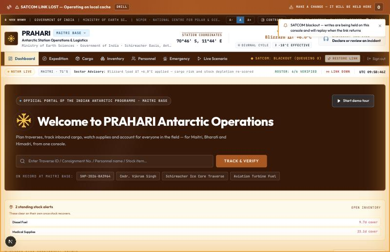
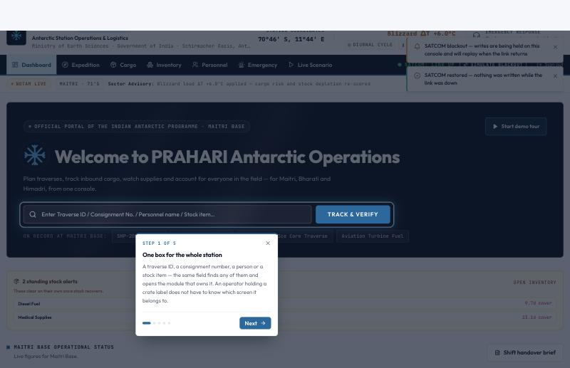
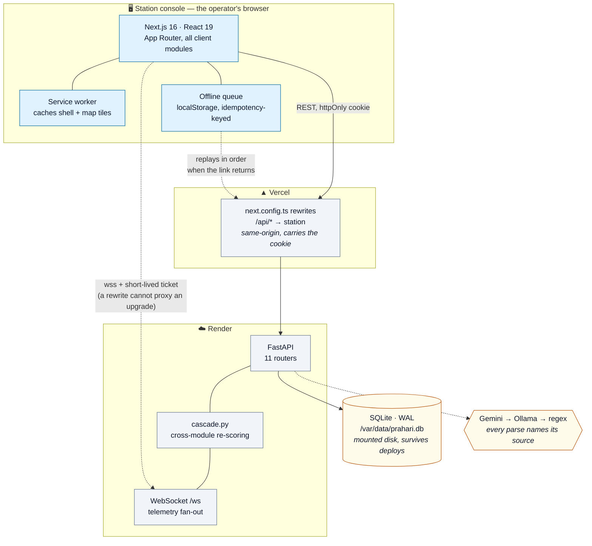
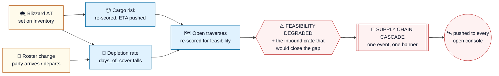
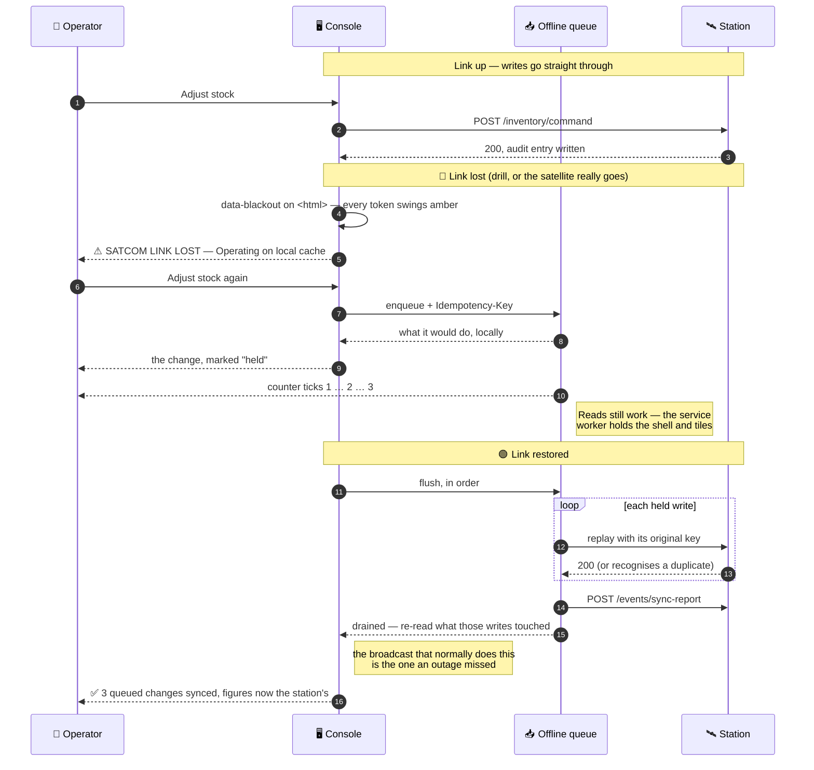
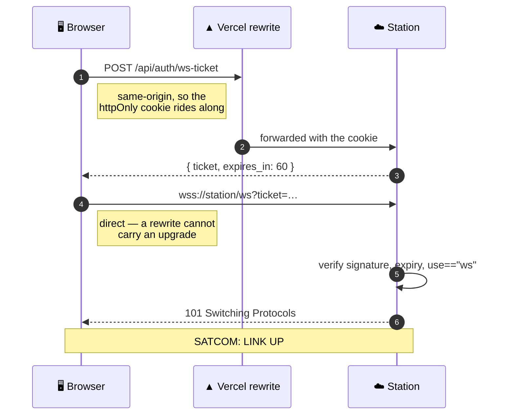
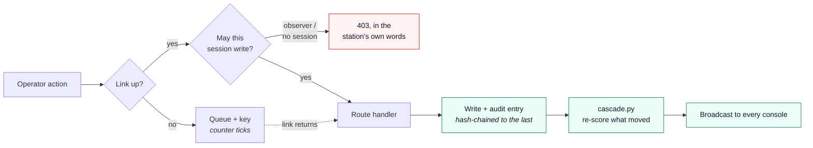
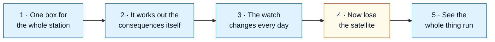

<div align="center">

# ❄️ PRAHARI

### Antarctic Logistics & Safety Intelligence Platform

**An offline-first station command console for Maitri, Bharati and Himadri —
built to keep working when the satellite does not.**

[](https://prahari-eta.vercel.app)
[](https://prahari-backend-etbj.onrender.com/docs)

[](https://nextjs.org/)
[](https://react.dev/)
[](https://fastapi.tiangolo.com/)
[](https://python.org/)
[](https://sqlite.org/)
[](#-tests)
[](#-high-contrast-display)
[](https://sih.gov.in/)

*Built by **Team 36 OURS** for the extreme edge of the world.*

</div>

---

## ▶️ Try it in ninety seconds

**<https://prahari-eta.vercel.app>**

1. Press **Sign in with the public demo key** — one click, no typing. The key
   is published and the station says so.
2. Press **▶ Start demo tour** in the hero. Five stops, arrow keys to move,
   Escape to leave.
3. Press **Simulate blackout** in the navigation band. The console turns amber
   and tells you the link is gone.
4. Change something — the ΔT slider on **Inventory** is the quickest. Watch the
   counter in the banner climb.
5. Press **Restore link**. Everything you did while "offline" replays in order,
   and the toast tells you how much.

That last sequence is the whole thesis: an outage costs an operator nothing.
Everything else on the page is what makes it worth keeping the station running
through one.

<div align="center">



<sub>**Link up.** The navigation band carries the genuine WebSocket state, not
decoration — `SATCOM: LINK UP` means a socket is open to the station right now.</sub>

</div>

<table>
<tr>
<td width="50%" valign="top">



**Link lost — the drill.** Every design token swings to amber, a banner pins
to the top, and the counter beside it is the real queue depth climbing as you
work. Labelled **DRILL**, because a console tinted amber under a satellite
warning is exactly the sort of thing somebody walks past and reports.

</td>
<td width="50%" valign="top">



**The guided tour.** Five spotlit stops over the console's best work. The
highlighted element stays clickable — the tour narrates, it never presses
anything on your behalf.

</td>
</tr>
</table>

---

## 📖 Contents

| | |
|---|---|
| [The challenge](#-the-challenge-sih26062) · [The solution](#️-the-solution) | What this is and why |
| [**Architecture**](#️-architecture) | Diagrams — system, cascade, blackout, tickets |
| [The five modules](#-the-five-modules) | What each one does |
| [**Quick start**](#-quick-start) · [Deploying](#-deploying) | Running it yourself |
| [Drills](#-drills) · [Guided tour](#-the-guided-tour) | Exercising the failure paths |
| [Field mode](#-field-mode) · [HF radio](#-hf-radio--the-rung-below-the-offline-queue) | Away from the desk |
| [Security model](#-security-model) | Credentials, sessions, tickets |
| [Tests](#-tests) · [Troubleshooting](#️-troubleshooting) | Verifying a change |

---

## 🧊 The Challenge: SIH26062

Antarctic research stations (Maitri, Bharati, Himadri) operate in the harshest
environment on Earth. Conventional logistics tooling assumes constant cloud
connectivity, reliable sensors and a single time zone. When a blizzard closes in
and the satellite uplink drops, the station is blind — and the data it does have
is scattered across five disconnected spreadsheets.

## 🛡️ The Solution

**Prahari** (Hindi: *sentinel*) is an offline-first station command console. It
unifies expedition planning, cargo tracking, inventory depletion, personnel
routing and emergency accountability behind **one shared event log**, so every
module reads the same truth.

### Engineering decisions worth defending

| Decision | Why |
|---|---|
| **Deterministic SQL for stock counts** | The LLM parses *intent*; it never produces a number anyone acts on. `/inventory/{station}/count` is a plain `SUM`, and it refuses to sum rows with mixed units rather than returning a plausible wrong figure. |
| **Honest AI degradation** | Every parse returns `parse_source` (`gemini` / `ollama` / `fallback`), and the UI shows which one ran. A demo must never claim "AI parsed this" when a regex did. |
| **Ordered audit log** | Events are ordered by an autoincrement `seq`, not by `created_at`. One user action emits several events inside the same second; sorting by time alone shows effects before causes. |
| **UTC everywhere, explicitly** | Every timestamp is ISO-8601 with a `Z`. SQLite's `CURRENT_TIMESTAMP` is naive and browsers parse it as *local* time, which silently shifts the whole timeline by the host's UTC offset. |
| **Per-station weather** | The blizzard ΔT is a row in `station_conditions`, not a process global. Cargo writes it, Inventory reads it, and it survives a restart. |
| **One active station, console-wide** | The station picker in the header is the single source of truth (`StationProvider`); every module scopes its queries to it. Personnel carry a `station`, so a berth check for Bharati no longer subtracts Maitri's headcount, and each module reports on the base the header names. |
| **Geographic incident scope** | Incidents carry coordinates, not a station column — an incident happens at a place. `/incidents?station=` filters by response radius rather than pretending the relationship is a foreign key. |
| **Cross-track deviation** | Route deviation is the perpendicular distance to the route's *segments*. Measuring to the nearest waypoint raises false alerts for anyone walking the authorised line between two distant waypoints. |
| **Level-H QR** | Cargo labels use 30% error correction so they still scan when frosted, torn or partly obscured. Images are generated per-label on request, not inlined into every list response. |
| **SQLite WAL** | `journal_mode=WAL` + `busy_timeout=5000` lets telemetry writes and dashboard reads proceed concurrently. |
| **Supply policy per item class** | Criticality is not one flat "< 15 days". A medical flight cannot land at Maitri mid-winter, so 20 days of pharmaceuticals is an emergency while 20 days of diesel is a normal interval between tanker runs. Each row is judged against its class (`app/routes/inventory.py: RISK_CLASS_POLICY`), and a station can override the floor per item. |
| **Burn rate follows the roster** | `base_burn_rate` is the rate at the station's nominal headcount; consumable and medical depletion is scaled by the crew actually on station. A traverse party arriving from Bharati moves the ration runway, which is exactly the figure that arrival should move. |
| **Alerts that outlive the tab** | A toast that vanishes in four seconds is not a record. Crossing a stock floor writes a standing `CRITICAL STOCK ALERT` to the audit log and clears it explicitly on recovery, so an operator who was on another page still finds it. |
| **Readiness is continuous, not a stored claim** | A feasibility score saved at planning time describes a moment that has passed. Any write that moves station conditions re-scores every open traverse (`app/cascade.py`), and the card reports the live figure beside the one it was approved against. |
| **Derived lateness, not a scheduler** | A consignment is overdue if the clock is past its ETA and nothing has been scanned in — computed on read. A station that is offline for days has no background job to catch up on, and the answer is never stale. |
| **No credential in the bundle** | The commander key is exchanged once for an httpOnly session cookie. It used to ship as `NEXT_PUBLIC_COMMANDER_KEY`, readable by anyone who opened devtools on the hosted console. Sessions are signed rather than stored, so a restart does not sign everyone out and there is no session table to leak. |
| **Enough fuel is not the same as sparable fuel** | Readiness asks both whether a traverse can be loaded *and* whether what is left behind outlasts it at the current burn rate. Weather does not take litres out of the tank — it raises the rate they leave it — so the first question alone is blind to the conditions a traverse would depart into. |
| **Alert state is a column, the log is history** | Whether a row is in alert is stored on the row. Deriving it by scanning the audit log meant the dashboard banner got slower every time anything was logged anywhere in the station. |
| **Station facts read once per scoring run** | The fuel row, the roster and the inbound cargo are identical for every traverse departing the same base, and re-scoring runs after every write that moves station conditions. |
| **The database outlives the container** | A hosted filesystem is ephemeral: a SQLite file inside the application directory is wiped by every deploy and every idle spin-down, and the console comes back on the bare seed. `PRAHARI_DB_PATH` puts it on a mounted disk, which is the difference between a station record and a scratchpad. |
| **An empty console says so** | The seed plants crew, stock and geofences but no consignments or incidents, because those are what an exercise creates. A dashboard of zeroes is indistinguishable from a backend that is down, so it says which it is and offers the one call that fills it. |
| **A measured burn rate beside the planned one** | `base_burn_rate` is what the station was *provisioned* to consume, and nothing had ever checked it against what the station actually used — while `days_of_cover` is built entirely on top of it. Every stock movement now lands in the audit log with a signed delta and a reason (`app/stock_ledger.py`), and the observed rate is derived from that. A station burning 40% more diesel than planned has a cover figure that is 40% optimistic, and nothing else on the page said so. |
| **What counts as consumption is narrow** | A stocktake correction is a measurement being put right; a transfer is stock moving house. Counting either would make the observed rate a record of paperwork. Only a recorded usage and fuel loaded onto a departing traverse are burn. |
| **Cold chain catches the failure before the breach** | A threshold tells you a vaccine was ruined; the rate of change tells you a compressor has stopped while the crate is still inside its band. Both are checked. An excursion counts up *on the row*, because the question on arrival is "was it ever out of band" and a crate that recovered reads as fine otherwise. |
| **Every temperature names its source** | Prahari has no sensors. A reading is either a gauge someone read or a logger that was downloaded, and the API requires `source` on every one. A console that could not tell the two apart would be presenting a typed figure as telemetry. |
| **Tamper-evident audit log** | Each entry is a SHA-256 over its own fields *and* the previous entry's hash, so an altered or deleted row breaks every link after it. `GET /events/verify` turns "every action is on the record" from an assurance into arithmetic a sceptic can check. It is evident, not proof — see the honesty matrix. |
| **Idempotency keys on replay** | The case the offline queue cannot detect on its own is a write the station received and acted on whose response never came back. Without a key, replaying it issues the stock twice. Each queue entry carries its own key for its whole life, so a retry is recognisable as the same intent. |
| **Five stages, not two** | `open` and `resolved` could not tell an incident nobody had seen apart from one with a snowcat already on the ice, which during a callout is the only difference that matters. Each stage is timestamped as it is entered, so a debrief can say how long acknowledgement and dispatch took. Committing an asset moves the stage by itself — a lifecycle nobody updates is a dropdown, not a record. |
| **Assets ranked on capability, not just distance** | Distance alone sent the nearest snowcat to a casualty while a helicopter with a medic sat eight minutes further out. Range is judged on the *round trip*, because the asset has to come back. Fuel is scored as reserve rather than tank level: there is nothing to choose between 82% and 100% for a two-kilometre callout. Every component of the score is returned, because a commander overruling a ranking mid-emergency needs to see what it weighed. |
| **Two roles, because there are two** | Commander/Logistics/Field would all currently resolve to "may write", and naming roles without enforcing them makes the console claim an access model it does not have. What genuinely differs is whether you can change the station's record, so that is what is modelled: an observer reads every module and writes nothing, and the role rides inside the signed session so it cannot be edited by its holder. |
| **An empty hosted station seeds itself** | A container comes up bare after every deploy, and a page of zeroes is indistinguishable from a backend that is down. `PRAHARI_SEED_DEMO_ON_BOOT` plants the season *only* when the station holds nothing, so it can never overwrite an operator's records — and it is off by default, because a real station's console must never invent them. |
| **A what-if is a question, not an event** | The console could not answer *if the ship slips ten days, does the traverse still go?* without making the change for real and undoing it — which puts a fiction in the audit log and in everyone else's console. `POST /inventory/what-if` scores the station twice, against the real snapshot and a modified copy, using `score_feasibility` and `compute_depletion` themselves. There is no second model to drift from the first, and it writes nothing: not the scenario, not the result, not an audit row. |
| **A projection says that it is one** | Every figure it returns is labelled, and the response carries the assumptions in the operator's own words. A number with no statement of what it took as given is a number nobody should act on, and an unlabelled projection gets read as a reading. |
| **Stockout risk resamples the station's own history** | Not a fitted curve and nothing learned from another station or season: the daily totals in this station's log, bootstrapped. Thirty days of cover at a steady rate and thirty at a rate that swings by four are different propositions, and `days_of_cover` cannot tell them apart. It refuses below five observed days rather than produce percentiles from three numbers, and the deterministic figure stays primary. |
| **Procurement is the first leg, not a second list** | The cargo board starts at the dock; a station's exposure starts weeks earlier when someone orders the fuel, so "not ordered yet" and "three days out" both read as absent. Dispatching an order *creates* the consignment through the real shipment path — barcode, risk score, cold-chain band, and the stock row the order named carried through. One chain, not two tables that mention the same cargo. |
| **A phone gets three buttons, not a smaller dashboard** | Outside, in gloves, an operator does three things: records what they used, says they are back, or calls for help. Field mode is one action per screen with targets well past the 44px floor, and nothing destructive on a single tap — consumption is confirmed against what the station understood, and SOS needs a deliberate hold, because a knock against a parka must not declare a station-wide emergency. |
| **Field mode is a default, not a cage** | A handset lands on the three-button view and can leave it, and the choice sticks. Trapping every narrow viewport would put the roster out of reach of someone who needs it on a phone, which is a worse failure than a desk user seeing one extra tap. |
| **A crate is scanned, not typed** | The stores bunker is the worst place in the station to take a glove off. Field mode opens the rear camera onto the crate label and the keyboard is the fallback, not the other way round — a frosted or torn label still has its ID on the manifest. The decoder is imported on demand, because three of field mode's four actions never need it and the page has to open on a bad link. |
| **A high-contrast theme that cannot break the default one** | GIGW 3.0 expects a portal to offer one, and a laptop carried onto the ice is read against snow under a sun that does not set. Every rule is scoped behind `[data-theme='contrast']` and *nothing* above it in `globals.css` was modified: with the attribute absent no selector matches and the standard console is byte-identical to what it was. `applyTheme()` removes the attribute rather than setting `data-theme="standard"` for exactly that reason. Map tiles are deliberately excluded — re-colouring the ground a traverse is about to cross would be a lie told for legibility. |
| **The handover is the artefact, not the dashboard** | A station runs continuously and the console does not. What the outgoing commander knows that is not written down goes to bed with them, and the relief sees only the present. The brief is station-wide and forward-looking, where the post-incident debrief is retrospective and about one closed incident. Each source may fail on its own and the document *names* the ones it could not read — a section that is blank because a call timed out, read at 3am, is indistinguishable from a station where nothing is wrong. |
| **A rung below the offline queue** | The queue assumes the link comes back. If the satellite terminal itself is down the queue holds forever, and Antarctic stations fall back to HF radio. Field mode used to tell an operator whose SOS could not be sent to "raise the alarm by radio" and hand them nothing — leaving somebody in trouble to compose a position report from memory. It now composes it: fixed field order, only characters ITA2 can carry, and a check group so a miscopied position is *known* to be miscopied. This is not compression — ITA2 is a narrower alphabet than ASCII, not a denser one — and the README says so rather than claiming otherwise. |
| **A dead accessibility control is worse than none** | The utility rail carried "Screen Reader" as a `<span>` that did nothing, between two controls that work. The support it named was real — skip link, landmarks, `aria-live` on every alert, keyboard operation — so the label read as a control that was simply broken. It now opens a statement, and the statement lists what the console *cannot* do as prominently as what it can: the maps are not readable by a screen reader, there is no Hindi, and both say so. Someone deciding whether they can use this console needs the gaps more than the wins. The language entry was the same defect one seat along — a `<span>` reading "English" — and got the same treatment rather than a dropdown with one item in it, which is still a dead control, or a machine-translated second language, which claims a capability the console does not have. It names the language, says it is not a switch, and opens on the line explaining why: the interface is ~450 strings and 95 sentences whose grammar is English, the telemetry would stay Latin by convention either way, and the HF radio fallback could not carry another script at all — ITA2 is a five-bit alphabet. |
| **A headline figure is a total, not a filtered count** | The four KPIs read `0 · 1 · 0 · 10d` on a station carrying three traverses, four consignments and two stock rows inside their critical window — because each headline was the narrow count and the context was the footnote. They are the other way round now. Nothing is padded to avoid a zero: every filtered figure is still shown, underneath. "How many are on my books" is the question this page is opened with; "how many of those are under way" is the follow-up. |
| **Every colour that carries text clears AA — and a test says so** | A sweep of the running console found the *default* theme failing WCAG AA in six places while the high-contrast theme it ships passed everywhere: `frost.muted` at 4.43:1 on a white card, `nominal` at 3.51, `alert` at 2.96, white-on-`arctic-600` at 4.10. Each token moved one step down its ramp — hues unchanged, only luminance. The dark bands went the *other* way, because the same "muted" value cannot serve a white card and a navy footer: darkening it to pass on one took it to 2.69:1 on the other. `lib/palette.test.ts` now asserts every pair, so this cannot drift back. |
| **A `min-width: auto` grid item is a sideways scroll waiting to happen** | A table inside a grid column will not let that column shrink below the table's content width, however carefully the table's own wrapper sets `overflow-x-auto`. On the inventory page the effect was visible rather than theoretical: the category filter row spilled straight out through the card's rounded border on a handset. |
| **A security header that outlived its premise** | `Permissions-Policy` said `camera=()` with a comment reading "the console asks for none of these". That was true when it was written and wrong from the moment the QR scanner shipped: it disabled the camera for the whole origin, so the cargo page's webcam scan and field mode's *Scan cargo* both failed in every browser — and failed looking like a broken camera rather than a broken header. `lib/headers.test.ts` now ties the policy to the code, granting only what something actually calls and denying the rest. Geolocation stays denied on purpose. |
| **One request, however many readers** | Four components read the blizzard ΔT and each fetched it separately, so a page load made three identical round trips for one small object and every `blizzard_update` triggered three more at the same instant. The state is shared now: a caller that asks while a request is in flight joins it. That is the difference between 9 requests and 6 on the cargo page, on the link this console is built for. |
| **A dialog gives focus back** | All four modals handled Escape and nothing else. Closing dropped focus onto `<body>`, so a keyboard operator was returned to the top of the document; two never moved focus *in*, leaving the first Tab walking the page behind the overlay; and none trapped Tab. One hook does all three. The handover button also has to name its trigger explicitly — it disables itself while reading the station, and a disabled control is blurred, so there is no previously-focused element left to infer. |
| **Boundaries per panel, not per page** | A Leaflet tile error used to take the accountability head-count and the resolve button down with the map. During an incident that is the worst possible trade. |

---

---

## 🏗️ Architecture

Two deployables and one file. The console is a Next.js app on Vercel; the
station is a FastAPI service on Render holding a SQLite database on a mounted
disk. Everything a module knows, it reads from the same event log.


```mermaid
flowchart TB
    subgraph browser["🖥️  Station console — the operator's browser"]
        UI["Next.js 16 · React 19<br/>App Router, all client modules"]
        SW["Service worker<br/>caches shell + map tiles"]
        Q["Offline queue<br/>localStorage, idempotency-keyed"]
        UI --- SW
        UI --- Q
    end

    subgraph vercel["▲  Vercel"]
        PROXY["next.config.ts rewrites<br/>/api/* → station<br/><i>same-origin, carries the cookie</i>"]
    end

    subgraph render["☁️  Render"]
        API["FastAPI<br/>11 routers"]
        WS["WebSocket /ws<br/>telemetry fan-out"]
        CAS["cascade.py<br/>cross-module re-scoring"]
        API --- CAS
        CAS --- WS
    end

    DB[("SQLite · WAL<br/>/var/data/prahari.db<br/><i>mounted disk, survives deploys</i>")]
    LLM{{"Gemini → Ollama → regex<br/><i>every parse names its source</i>"}}

    UI -->|"REST, httpOnly cookie"| PROXY
    PROXY --> API
    UI -.->|"wss + short-lived ticket<br/>(a rewrite cannot proxy an upgrade)"| WS
    Q -.->|"replays in order<br/>when the link returns"| PROXY
    API --> DB
    API -.-> LLM

    classDef edge fill:#e0f2fe,stroke:#0369a1,color:#0f172a
    classDef cloud fill:#f1f5f9,stroke:#64748b,color:#0f172a
    classDef store fill:#fffbeb,stroke:#b45309,color:#0f172a
    class UI,SW,Q edge
    class PROXY,API,WS,CAS cloud
    class DB,LLM store
```

**Why the socket takes a different road.** A platform rewrite forwards HTTP but
will not carry a WebSocket upgrade, so the socket is opened against the station
directly. The session cookie belongs to the console's host and is therefore
never sent there — which is why the handshake carries a
[short-lived ticket](#the-websocket-ticket) instead.

### The cross-module chain

The modules are wired to each other, not merely to the database. This is the
part no single module owns, and `app/cascade.py` exists because the routers
already import one another and putting it in any of them closes a cycle.


```mermaid
flowchart LR
    W["🌨️ Blizzard ΔT<br/>set on Inventory"] --> C["📦 Cargo risk<br/>re-scored, ETA pushed"]
    W --> S["🔋 Depletion rate<br/>days_of_cover falls"]
    C --> E["🗺️ Open traverses<br/>re-scored for feasibility"]
    S --> E
    R["👥 Roster change<br/>party arrives / departs"] --> S
    E --> A{{"⚠️ FEASIBILITY DEGRADED<br/>+ the inbound crate that<br/>would close the gap"}}
    A --> L[["📜 SUPPLY CHAIN CASCADE<br/>one event, one banner"]]
    L --> WS(("🛰️ pushed to every<br/>open console"))

    classDef trigger fill:#fffbeb,stroke:#b45309,color:#0f172a
    classDef effect fill:#e0f2fe,stroke:#0369a1,color:#0f172a
    classDef alarm fill:#fef2f2,stroke:#b91c1c,color:#0f172a
    class W,R trigger
    class C,S,E effect
    class A,L,WS alarm
```

A traverse that falls below what it was *approved* against raises the alarm and
offers the consignment that would close the gap, with the hours to wait. The
card reports the live figure beside the approved one, because a feasibility
score saved at planning time describes a moment that has passed.

### An outage, end to end

The claim is that an outage costs an operator nothing. This is the mechanism.


```mermaid
sequenceDiagram
    autonumber
    participant Op as 👤 Operator
    participant UI as 🖥️ Console
    participant Q as 📥 Offline queue
    participant St as 🛰️ Station

    Note over UI,St: Link up — writes go straight through
    Op->>UI: Adjust stock
    UI->>St: POST /inventory/command
    St-->>UI: 200, audit entry written

    Note over UI,St: 🔶 Link lost (drill, or the satellite really goes)
    UI->>UI: data-blackout on <html> — every token swings amber
    UI-->>Op: ⚠ SATCOM LINK LOST — Operating on local cache

    Op->>UI: Adjust stock again
    UI->>Q: enqueue + Idempotency-Key
    Q-->>UI: what it would do, locally
    UI-->>Op: the change, marked "held"
    Q-->>Op: counter ticks 1 … 2 … 3
    Note right of Q: Reads still work — the service<br/>worker holds the shell and tiles

    Note over UI,St: 🟢 Link restored
    UI->>Q: flush, in order
    loop each held write
        Q->>St: replay with its original key
        St-->>Q: 200 (or recognises a duplicate)
    end
    Q->>St: POST /events/sync-report
    Q-->>UI: drained — re-read what those writes touched
    Note right of UI: the broadcast that normally does this<br/>is the one an outage missed
    UI-->>Op: ✅ 3 queued changes synced, figures now the station's
```

**What the operator sees while it is held.** A write can declare what it
means locally, so the console shows the change rather than carrying on
describing a station where nothing happened — a blizzard load applied during
an outage used to leave the header on the old figure and the slider looking
like it had done nothing. Every held value is *named* as held (`Held on this
console · NOT YET SENT`), because a console that quietly showed the operator
their own input back as though the station had accepted it would be lying in
the one direction that matters.

Nothing is derived from it. `days_of_cover` is quantity over a burn rate
scaled by crew and weather, and that arithmetic lives on the backend; a copy
in the browser would be a second model to drift from the first. So a figure
that depends on a held write is left as the station's last answer rather than
recalculated. For the same reason a plain-language stock command cannot be
shown locally at all — resolving *"removed 500 litres of diesel"* to a row and
a delta is the server's parser, and guessing at it would be inventing a
reading.

Order is preserved and the run stops at the first network failure, because a
later write may depend on an earlier one. A `4xx` that is a verdict on the
request is dropped with a logged reason; `401`, `403`, `408` and `429` are
about the *moment*, not the request, so the work waits.

### The WebSocket ticket


```mermaid
sequenceDiagram
    autonumber
    participant B as 🖥️ Browser
    participant V as ▲ Vercel rewrite
    participant S as ☁️ Station

    B->>V: POST /api/auth/ws-ticket
    Note right of B: same-origin, so the<br/>httpOnly cookie rides along
    V->>S: forwarded with the cookie
    S-->>B: { ticket, expires_in: 60 }

    B->>S: wss://station/ws?ticket=…
    Note right of B: direct — a rewrite cannot<br/>carry an upgrade
    S->>S: verify signature, expiry, use=="ws"
    S-->>B: 101 Switching Protocols
    Note over B,S: SATCOM: LINK UP
```

A ticket rides in a URL, and URLs end up in access logs — so it lives sixty
seconds, carries a `use` claim that stops it being replayed as a session
cookie, and carries the holder's role rather than granting one. A fresh one is
minted per attempt, because a reconnect can be long after the last one.

### Request lifecycle


```mermaid
flowchart LR
    A["Operator action"] --> B{"Link up?"}
    B -->|no| Q["Queue + key<br/><i>counter ticks</i>"]
    B -->|yes| C{"May this<br/>session write?"}
    C -->|"observer /<br/>no session"| R["403, in the<br/>station's own words"]
    C -->|yes| D["Route handler"]
    D --> E["Write + audit entry<br/><i>hash-chained to the last</i>"]
    E --> F["cascade.py<br/>re-score what moved"]
    F --> G["Broadcast to every console"]
    Q -.->|"link returns"| D

    classDef no fill:#fef2f2,stroke:#b91c1c,color:#0f172a
    classDef yes fill:#ecfdf5,stroke:#047857,color:#0f172a
    class R no
    class E,F,G yes
```

### Repository layout

```
prahari/
├── backend/                     FastAPI · Python 3.11+
│   ├── app/
│   │   ├── main.py              app, lifespan, /ws, /health
│   │   ├── auth.py              keys, signed sessions, WS tickets
│   │   ├── cascade.py           cross-module re-scoring
│   │   ├── events.py            hash-chained audit log
│   │   ├── forecast.py          depletion, stockout bootstrap
│   │   ├── geo.py               Haversine, cross-track, geofences
│   │   ├── stock_ledger.py      signed deltas → measured burn rate
│   │   └── routes/              11 routers
│   └── tests/                   762 tests
└── frontend/                    Next.js 16 · React 19
    └── src/
        ├── app/                 8 routes (App Router)
        ├── components/          console UI
        │   ├── BlackoutBanner   the outage, made visible
        │   ├── DemoTour         five-stop guided walk
        │   ├── SignInPanel      shared by the wall and the dialog
        │   └── WebSocketProvider  telemetry + ticket exchange
        └── lib/                 queue, geo, palette, handover, HF radio
```

---

## 🌌 The five modules

1. **🗺️ Expedition Planning** — Plain-language request → Gemini (→ Ollama → regex)
   → a readiness score weighted across crew, fuel, inbound cargo and berths.
   Every line item reports what is short and by how much.
2. **📦 Cargo Tracking** — QR-driven status chain
   (`dispatched → in_transit → arrived → unloaded`). Unloading replenishes the
   matching inventory item. Blizzard ΔT re-scores risk and pushes the ETA.
   Medical and food consignments carry a **temperature band** and are checked
   two ways: against the band, and against the rate they are moving — a reefer
   whose compressor has stopped is still inside its band for the first hour.
   Excursions are counted on the crate, so one that recovered still reports
   that it was out of band, and an excursion re-scores the station through the
   same cascade a delay does.
3. **🔋 Dynamic Inventory** — `days_of_cover = quantity / (base_burn_rate × crew_factor × (1 + β × ΔT))`,
   recomputed live against the station's blizzard load *and* the crew currently
   on station. The ΔT slider sits on the Inventory page itself, so the formula
   can be driven where its output is read. Stock is adjusted with a **text
   command** (`POST /inventory/command`, e.g. *"Removed 10 litres of diesel
   fuel"*): the command is parsed, previewed, and only written on confirm, always
   scoped to the console's active station. An ambiguous item comes back as
   clickable candidates rather than a dead-end error. `GET /inventory/cross-station`
   answers "does another base have this?" in one query. Every movement is
   recorded with a signed delta and a reason, which is what makes the
   **measured burn rate** — shown beside the planned one — a reading of the
   station's own record rather than a second guess.
4. **📍 Personnel Routing** — Sign in first: the roster carries live positions
   for everyone in the field and is not served anonymously. Authorise a
   movement plan on a **map**: click to
   place waypoints and steer the corridor around a crevasse field, with a live
   verdict on how many restricted zones the path still crosses. Then replay GPS
   fixes along it with a progress meter and a telemetry read-out — heading,
   ground speed, distance remaining and ETA, derived from the authorised
   schedule rather than from the console's tick rate.
5. **🚨 Emergency Accountability** — SOS or declared incident → head-count inside
   the affected radius + nearest assets by Haversine distance. Only `at_station`
   and `returned` count as verified safe, and an incident **cannot be resolved**
   while anyone is unaccounted for. Each incident type carries a **response
   protocol** whose steps are ticked off and timestamped into the audit log,
   rescue assets are **dispatched and released** from the same panel, and both
   severity and perimeter can be changed on a live incident — widening the
   radius re-runs the head-count against the new circle instead of forcing a
   resolve-and-redeclare that discards the count. A response moves through
   **five stages** — declared, acknowledged, responding, contained, resolved —
   each timestamped as it is entered, and committing an asset advances the
   stage by itself. Assets are ranked on **capability**: distance, fuel in
   reserve, whether the round trip is within range, and whether a medic is
   aboard, with every component of the score shown.

---

## 🚀 Deploying

The backend is closed by default and will not start unprotected, so a first
deploy needs four values. Render prompts for each on a blueprint sync.

**Render** (backend):

| Variable | Value |
|---|---|
| `PRAHARI_API_KEY` | Any long random string. `python -c "import secrets; print(secrets.token_urlsafe(32))"` |
| `PRAHARI_CORS_ORIGINS` | The console's own URL, e.g. `https://prahari.vercel.app` |
| `PRAHARI_CORS_PROJECT` | Your Vercel project name, e.g. `prahari` — only needed if preview deployments should work too |
| `PRAHARI_ALLOW_DEMO_KEY` | `false` (already set in the blueprint) |

The blueprint also sets `healthCheckPath: /health`, which is what Render polls
to decide a deploy came up — and polling it keeps the instance from sleeping,
so nobody's first visit is a cold start. It sets `PRAHARI_ALLOW_OBSERVER` and
`PRAHARI_SEED_DEMO_ON_BOOT` too, so a hosted console opens on a populated
station that a visitor can actually look at. **Unset both for a real
deployment.**

The blueprint also asks for a **1 GB disk at `/var/data`**, with
`PRAHARI_DB_PATH=/var/data/prahari.db`. This is the difference between a
station that remembers what it was told and one that forgets on every deploy.
A disk needs a paid instance type; to stay on the free tier, delete the `plan`
and `disk` blocks and `PRAHARI_DB_PATH` from `render.yaml` and accept that the
record resets on restart — `POST /admin/demo-season` puts a populated season
back in one call.

**Vercel** (console):

| Variable | Value |
|---|---|
| `BACKEND_URL` | The station's URL, e.g. `https://prahari-backend.onrender.com`. `next.config.ts` rewrites `/api/*` to it, which is what keeps the console and the API same-origin — and therefore what lets the session cookie work. |
| `NEXT_PUBLIC_WS_URL` | `wss://<the same host>/ws`. **Required on any hosted deploy**, and the reason is below. |
| ~~`NEXT_PUBLIC_COMMANDER_KEY`~~ | **No longer used.** The console holds no credential. Delete it if it is still set. |

> [!IMPORTANT]
> **The socket cannot go through the rewrite.** A Vercel rewrite forwards HTTP
> but will not carry a WebSocket upgrade — the request arrives at the station
> as a plain `GET /ws`, which has no HTTP route, and the console reports a link
> that is from its own point of view down. Point `NEXT_PUBLIC_WS_URL` straight
> at the backend. The handshake then authenticates with a
> [short-lived ticket](#the-websocket-ticket) rather than the cookie, which
> cannot reach another host.
>
> If both link indicators read red while every other part of the console works,
> this is why.

### Confirming a deploy from outside

```bash
curl -s https://<your-backend>/health | python3 -m json.tool
```

`/health` reports whether a real key is configured, whether the demo key is
live and whether reads are public — so the posture can be checked rather than
remembered. Two more worth knowing:

| Symptom | Cause |
|---|---|
| A page of zeroes | The station is empty. `PRAHARI_SEED_DEMO_ON_BOOT=true`, or press **Load demo season** on the dashboard. |
| A 30–60s wait on first load | A free Render instance has gone to sleep. The health check keeps a paid one warm; on free, open the site a few minutes before anyone else does. |

### The live deployment

| | |
|---|---|
| **Console** | <https://prahari-eta.vercel.app> |
| **Station API** | <https://prahari-backend-etbj.onrender.com> · [`/docs`](https://prahari-backend-etbj.onrender.com/docs) |
| **Sign-in** | One click — the station runs the published demo key and says so |
| **Posture** | Demo: writes accepted on a published key, reads gated behind sign-in. Not a configuration to copy for a real station. |

---

## ⚡ Quick start

**Requirements:** Python 3.11+ and Node 20+.

### 1. Configure

```bash
cp backend/.env.example backend/.env
cp frontend/.env.local.example frontend/.env.local
```

Set `PRAHARI_API_KEY` in `backend/.env` — that is the key you sign in with.
The console holds no credential of its own, so `frontend/.env.local` only
matters if the backend is not on `localhost:8000`. `GEMINI_API_KEY` is
optional: without it the chain falls back to Ollama, then to regex, and the UI
says which one ran.

### 2. Backend

```bash
cd backend && pip install -r requirements.txt && python -m uvicorn app.main:app --reload --port 8000
```

On boot it prints which LLM path is live. Interactive API docs: <http://localhost:8000/docs>

### 3. Frontend

```bash
cd frontend && npm install && npm run dev
```

**Fonts:** three faces, self-hosted by `next/font` at build time, so a running
console makes no request to a CDN — which matters on a link that drops.
Nothing to install.

| Face | Carries |
|---|---|
| **Outfit** | Interface text |
| **IBM Plex Mono** | Telemetry — coordinates, ΔT, counts. A wider aperture and unambiguous `0`/`O`, `1`/`l` at small sizes, which is what a latitude has to survive |
| **JetBrains Mono** | IDs and code-like strings |

### 4. Put something on it

A freshly seeded station has crew, stock and geofences but nothing in flight,
so Cargo and Emergency open empty. **Load demo season** — on the dashboard
while the station is idle, and always on `/scenario` — plants a mid-season
picture across all three bases: consignments part-way along their run, one
convoy already overdue, a crewed traverse short on fuel at Maitri, and a closed
incident on the record. It restores the baseline first, so it is safe to click
twice, and it announces itself in the audit log as synthetic.

```bash
curl -X POST localhost:8000/admin/demo-season -H 'X-Commander-Key: <your key>'
```

### 5. Two guided routes

| | Where | What it does |
|---|---|---|
| **▶ Start demo tour** | Dashboard hero | Five spotlit stops over the console's best work, ending on the blackout drill. Narrates only — it never presses anything for you. Arrow keys move, Escape leaves. |
| **Live Scenario** | `/scenario` | A ten-step walkthrough that *exercises* all five modules end to end against the real backend, including a geofence violation and an offline queue-and-flush cycle. |

The tour is for somebody deciding whether to keep looking. The scenario is for
somebody who has decided.

---

## 🧭 The guided tour

Somebody handed this link has under a minute, and the console does not lead
with its best work. The universal lookup looks like a search box. The standing
alerts look like a notification list rather than the station reasoning from a
blizzard through to the cargo that will land late and the stock that runs out
before it arrives. And the one genuinely unusual thing here — surviving a lost
satellite — was a toggle in the corner of the navigation band that nobody would
press without being told what it was for.

**▶ Start demo tour**, top-right of the dashboard hero. Five stops:


```mermaid
flowchart LR
    S1["1 · One box for<br/>the whole station"] --> S2["2 · It works out the<br/>consequences itself"]
    S2 --> S3["3 · The watch<br/>changes every day"]
    S3 --> S4["4 · Now lose<br/>the satellite"]
    S4 --> S5["5 · See the<br/>whole thing run"]

    classDef step fill:#e0f2fe,stroke:#0369a1,color:#0f172a
    classDef wow fill:#fffbeb,stroke:#b45309,color:#0f172a
    class S1,S2,S3,S5 step
    class S4 wow
```

Ordered so it builds: what the console knows, what it works out for itself,
what it hands over, what it survives, and where to watch the whole thing run.

Three things it deliberately does **not** do:

* **It does not drive.** No step presses a button, loads data or changes a
  record on your behalf. The blackout stop explains the drill and leaves the
  control lit, because a console that runs itself while you watch is a video,
  and the point is that this one is real. The highlighted element stays
  clickable for exactly that reason.
* **It does not navigate.** Every stop is on the dashboard or in the
  navigation band. A tour that moves between modules waits for each page to
  fetch before it can find its next anchor, and somebody watching a spinner
  has stopped reading.
* **It does not strand you.** A stop whose anchor is not on your screen — the
  navigation band is hidden below `md` — still shows its card, centred,
  rather than going blank.

Escape leaves, arrow keys step, clicking the dimmed area leaves (everyone
tries it), focus moves to the card and returns to the control that opened it.

---

## 👁 Observer access

A station that is closed by default is the right posture and the wrong first
impression: anyone handed the link meets a key prompt and a console correctly
refusing to show them anything.

`PRAHARI_ALLOW_OBSERVER=true` adds an **Enter as observer** button to the
sign-in screen. It issues a real, expiring, signed session that can read every
module and write nothing — a refused write comes back `403` with a sentence
saying why, and the navigation band carries a standing **READ ONLY** badge so
nobody discovers the limit only when a control refuses them.

It is deliberately *not* the same switch as `PRAHARI_PUBLIC_READS`. That one
serves reads to anyone who knows the URL with no session at all; this one
issues a session the audit log can attribute. Both are off by default, because
the roster carries live positions for people in the field and whether that is
shareable is a decision for whoever runs the station.

The role lives inside the signed session payload, so an observer cannot
promote themselves by editing a cookie, and the `X-Commander-Key` header
always outranks a browser session — a script is never downgraded by whatever
the browser last did.

---

## 📱 Field mode

A handset opening the console lands on `/field`: four targets, one action
per screen, sized for a gloved thumb.

| Action | What it does |
|---|---|
| **Log consumption** | Pick the item, step the amount in units that suit it — 10 at a time for litres and kilograms, 1 for counted things — and confirm. It composes the same plain-language command the desk console uses, so a field entry lands in the ledger identically: same parser, same reason, same audit line, and it moves the measured burn rate like any other draw. |
| **Scan cargo** | Opens the rear camera onto a crate label and advances the consignment the moment it decodes. The same `scanBarcode` path the cargo page has always used, behind a screen that works in gloves. The manifest code can be typed instead — always offered, not revealed on failure, because discovering the fallback while holding a crate is worse than seeing one extra field. |
| **Check in** | Back at the station, or still out. Only the first counts as accounted for in a head-count, which is what lets an incident close. |
| **SOS** | Declares a critical incident at your last known position and counts everyone nearby. Held, not tapped — a knock against a parka must not raise a station-wide emergency. |

It asks once who is holding the handset, because all three actions are about
a person and an anonymous SOS is a much worse artefact than one extra tap.
That is remembered on the device and the UI says what it is: not a sign-in.

The link state sits above the buttons throughout, because out there it is the
difference between *the station knows* and *this handset knows* — and when a
write is queued, the console says so rather than reporting success. The SOS
screen is emphatic about it: no link means the station has **not** been told,
and to raise the alarm by radio — and it hands over the message to read out
(see *HF radio* below) rather than leaving someone in trouble to compose a
position report from memory.

It is a default, not a cage. `/field` carries a link to the full console and
the choice sticks, because trapping every narrow viewport would put the
roster out of reach of someone who needs it on a phone.

---

## 📻 HF radio — the rung below the offline queue

Prahari's offline story stops at one assumption: that the link comes back.
The queue holds work on the handset and drains when it does. If the satellite
terminal itself is down — a failed modem, a collapsed dish, a storm on the
antenna — the queue holds forever, and the station is left with what Antarctic
stations have always fallen back on.

You cannot put JSON over HF. What you can do is hand the radio operator a
short block to key or read aloud, and that is all `lib/hfRadio.ts` produces:

```
ZCZC PRAHARI SOS
DE MAITRI
FLASH 28SEP26 1823Z
SOS DISTRESS
OP DR. PRIYA SHARMA
POS 7046.0S 01143.9E
ACK REQUIRED
CK 11 RN
NNNN
```

`ZCZC` and `NNNN` open and close a teleprinter message on the aeronautical
fixed service, `DE` means *from*, and `CK` is the check. The position is
degrees and decimal minutes with a hemisphere — the format already on the
form the receiving operator is writing on.

**This is not compression, and calling it that would be a lie.** ITA2 — the
five-bit Baudot-Murray alphabet a teleprinter actually carries — is a
*character set*, narrower than ASCII, not denser. The useful work is the
opposite:

- **Restricting** the text to what the mode can carry at all. ITA2 has no
  lower case, no `°`, no `Δ`, no em dash, and the console's own copy is full
  of all three. They are transliterated (`-18 DEG C`, `DELTA T +12`), accents
  are stripped to the base letter so `Nuñez` goes out as `NUNEZ`, and anything
  still unrepresentable becomes a *space* rather than being deleted — a gap
  can be queried by the operator reading it back, a silent deletion cannot.
- **Fixing the field order**, so the message is transcribed rather than parsed.
- **Attaching a check**, so a corrupted message is *known* to be corrupted.
  The word count catches a dropped word; the two-character group is a
  positionally-weighted sum, so transposing two digits changes it where a
  plain sum would not. It detects accident and is not meant to resist anyone.

Three messages exist: `SOS` (FLASH), a stores demand (`LOGREQ`), and a station
`SITREP`, which is raised from ROUTINE to IMMEDIATE by an unaccounted person
or a live incident. The SITREP is also printed at the foot of every shift
handover brief — a handover is the moment someone is about to be the only
person awake, and if the terminal fails during their watch the console can no
longer generate anything.

Where a position is not known, the message says `POS UNKNOWN LAST SEEN AT STN`.
A fabricated position is worse than none: it sends a search to the wrong place.

---

## 📋 Shift handover brief

A polar station runs 24 hours and the console does not. When the day commander
goes to sleep, everything they know that is not written down goes with them —
which consignment is late, who is still out, which stock row they have been
watching all week. The relief reads a dashboard showing the *present*.

**Generate shift handover brief** on the dashboard reads the station and
renders a plain-text document: people first, then incidents, conditions,
stores, cargo, procurement, the tail of the audit log, and the radio SITREP.
It opens to be read — the handover usually happens over a desk — with
download, copy and print from there.

It is a different artefact from the post-incident debrief in `lib/debrief.ts`:
that one is retrospective, concerns a single closed incident, and is filed.
This one is station-wide, forward-looking, and thrown away at the end of the
next watch. They share their formatting so a commander who can read one can
read the other.

Two rules it keeps:

- **Every source may fail on its own, and the document names the ones that
  did.** A cargo section that is blank because that call timed out is
  indistinguishable, at 3am, from a station with nothing in transit. The brief
  prints `** INCOMPLETE — ... Treat each of those sections as unknown, not as
  empty. **`
- **Anything that is not a measurement says so on its own line.** The seasonal
  figure is labelled *published normal, NOT a reading* and the blizzard load
  as *operator-entered*, because a handover is read quickly by someone who has
  just woken up, and that is exactly when an unlabelled number gets taken as
  telemetry.

---

## 🔆 High-contrast display

The utility rail carries a **Contrast** toggle beside the A- / A / A+ text
size control, and it is one of the few controls that is *not* hidden on a
handset — the phone is the device that goes outside.

Two constituencies, one answer. GIGW 3.0 expects a government portal to offer
a high-contrast view. And a station laptop carried onto the ice is read
against snow, under a sun that does not set for months: the default canvas is
a pale ice wash, which is the worst possible surface in that light because the
glare it throws back competes with everything drawn on it. Both wants resolve
to the same thing — drop the page to black, push the foreground to maximum,
thicken every boundary. Every colour clears WCAG AA against black, and the
sweep that proves it is described under *Verifying a change*.

The implementation has one property worth stating plainly: **it cannot break
the standard console.** Every rule lives behind `[data-theme='contrast']` at
the foot of `globals.css`, and nothing above that line was modified to
accommodate it. With the attribute absent, not one of those selectors matches.
`applyTheme()` removes the attribute rather than setting `data-theme="standard"`
for exactly this reason, and a test asserts it.

The cost of that choice is honest to state: because the palette in
`tailwind.config.ts` is literal hex rather than variables, the utility classes
are re-pointed by hand in that block. The set was enumerated from the
codebase, not guessed, and a component introducing a colour family not listed
there will not follow the theme.

Both themes are swept for contrast the same way, and both come back clean —
see *The contrast sweep* under **Verifying a change**. The default theme did
not start out that way: the sweep is what found it failing in six places
while the high-contrast theme passed everywhere, which is the wrong way
round for the theme most people actually use.

The theme is applied by a small synchronous script at the top of `<body>`,
before React. Without it, an operator who chose high contrast gets a
full-screen flash of the pale default on every load — which is precisely what
they turned it on to avoid.

**Map tiles are deliberately excluded.** They are photographic terrain, and
re-colouring the ground a traverse is about to cross would be a lie told in
the name of legibility. The chrome around the map flips; the map does not.

---

## 🚚 Inbound procurement

The cargo board starts at the dock. `GET /procurement` covers the weeks
before that — what the station has on order, from whom, and what the vendor
promised. Lateness is derived from the promised date on read, exactly as a
consignment's is from its ETA.

The orders are not a parallel list. `POST /procurement/{id}/dispatch` calls
the real shipment-creation path, so the crate that appears on the cargo board
is an ordinary consignment with a barcode, a risk score, a cold-chain band
where its category has one, and the stock row the order named already
attached. The order becomes `shipped` and the two are linked both ways.

Only a **confirmed** order can be dispatched: an order the vendor has not
acknowledged is not cargo, and a crate on the board for one nobody agreed to
supply is a lie the rest of the console would then plan around.

This is not a vendor portal. Vendors do not log in, and nothing is sent to
them. It is the station's own record of what it is owed, which is the part
the station is answerable for.

---

## 🔮 Asking "what if"

`POST /inventory/what-if?station=Maitri` scores the station as it stands and
as a scenario would leave it, side by side. Four levers, all optional:

| Field | Means |
|---|---|
| `extra_crew` | People arriving or leaving. Negative is a party departing. |
| `delta_t` | Blizzard load, absolute — it is the one an operator thinks of as a value rather than a change. |
| `cargo_delay_hours` | Slip every inbound consignment. A ship that is late is still inbound; it just arrives later. |
| `advance_days` | Burn this many days of stock at the projected rate first, so "in a fortnight, with six more people" is one question. |

```bash
curl -X POST 'localhost:8000/inventory/what-if?station=Maitri' \
  -H 'Content-Type: application/json' -H "X-Commander-Key: $KEY" \
  -d '{"extra_crew": 6, "advance_days": 7}'
```

It writes nothing — not the scenario, not the result, not an audit row — and
it is gated as a read, because thinking before committing should not need
write credentials. The Inventory page carries it with three one-click
presets.

The figures come from `score_feasibility` and `compute_depletion`, the same
functions the live console uses, handed a snapshot with the scenario applied.
`test_projection` pins the consequence: a projected blizzard reaches the same
days-of-cover figure as applying one for real. If those two ever disagree,
there are two models and one of them is wrong.

---

## 🎲 Stockout risk

`days_of_cover` answers "at today's rate". `GET /inventory/stockout-risk`
answers "given how this station has actually consumed it" — the soonest
realistic day it runs out and the most likely one, with
`?until_days=30` answering the question an operator really has: *does it
reach the next tanker window?*

The distribution is the station's own daily totals, resampled. No curve is
fitted, nothing is assumed about the shape, and nothing is learned from
another station or another season. Below five observed days of consumption
it reports nothing at all — percentiles from three numbers look exactly as
authoritative as percentiles from thirty, which is the failure worth
avoiding. The deterministic figure stays primary and is never replaced.

---

## 🔍 What is measured, and what is not

Prahari runs on a laptop with no sensor network attached. Everything below is
either something the station recorded, something Prahari worked out from what
it recorded, or a figure that stands in for hardware that is not there. The
distinction matters more than any single feature: a console that cannot tell
you which is which is one you cannot act on.

| Fact on screen | Where it comes from | Honest? |
|---|---|---|
| Station coordinates | Published NCPOR positions, hard-coded and matching the geofence table | **Real** |
| Distances, bearings, route deviation | Computed by great-circle maths from those coordinates | **Derived** — real arithmetic on real positions |
| Daylight state, seasonal normals | Solar declination from the station's own latitude (Cooper's equation) and published climatological normals | **Derived / reference** — never presented as a thermometer reading |
| Stock quantities | What an operator recorded, plus what unloading a consignment added | **Real** — entered, not sensed |
| Days of cover | `quantity / (burn rate × crew factor × weather factor)` | **Derived** |
| Planned burn rate | A configured constant per item | **Assumption** — the console now says so by showing the measured rate beside it |
| A what-if projection | The live formulas run against a modified copy of the station | **Derived, and labelled** — the response says `is_projection` and lists its assumptions; nothing is written |
| Stockout range (P10–P50) | Bootstrap resample of this station's own recorded daily consumption | **Derived from real records**, withheld entirely below five observed days |
| Measured burn rate | Derived from consumption movements in the audit log | **Derived from real records**, and withheld entirely until there is enough history to divide by |
| Crew positions | Seeded, then advanced by the GPS playback | **Simulated** — no GPS hardware exists; the movement is a replay of an authorised route |
| Blizzard ΔT | Typed by an operator on the slider | **Simulated input** — Prahari has no meteorological feed, and the header shows ΔT rather than inventing an air temperature |
| Cargo temperature | Typed by an operator, or entered from a handheld logger read-out | **Recorded** — `source` is stored and shown on every reading; there is no live probe |
| Cargo risk score | Weather ΔT and priority | **Derived** from a simulated input |
| Consignment ETA | Nominal fourteen-day sea leg, pushed by weather | **Modelled** — there is no vessel tracking |
| Overdue detection | The clock against the stored ETA | **Derived** — real time, modelled ETA |
| Beacon ping | Records that the station *asked*, and returns the last facts it holds | **Honest stub** — the response says outright that there is no satellite link |
| Asset fuel, range, seats, medic | Seeded capability figures per asset | **Reference data** — not telemetry from the vehicles |
| Head-counts and accountability | Personnel status, which an operator sets | **Real** — as accurate as the last check-in |
| Audit chain | SHA-256 over each entry and the one before it | **Real, and tamper-*evident*** — a writer with database access could recompute the whole chain. Not tamper-proof, and `/events/verify` says so in its own response |
| Every expedition parse | Gemini, else Ollama, else regex — `parse_source` names which ran | **Real**, and the UI never claims AI when a regex did the work |
| Purchase orders and vendor names | Synthetic, planted by the demonstration season | **Synthetic** — no vendor system is contacted and nothing is sent to anyone; this is the station's own record of what it has on order |
| The accessibility statement | Hand-maintained, checked against the code | **A claim, and it lists its own gaps** — if a line stops being true it is wrong and must be corrected, not left standing |
| A shift handover brief | Every section read from the station's own records at generation time | **Derived**, and it names any source it could not read rather than printing an empty section |
| An HF radio message | Composed from the same records, restricted to the ITA2 character set | **Derived** — and it is not transmitted. Prahari has no radio; it produces text for a human to key or read aloud |
| The HF check group | A positionally-weighted sum over the message body | **Derived** — a transcription check that detects accident. Not a cryptographic one, and not meant to resist anyone |
| The demonstration season | Synthetic records planted by `/admin/demo-season`, or on boot where `PRAHARI_SEED_DEMO_ON_BOOT` is set and the station is empty | **Synthetic**, and the audit log says so in the entry that creates it |

What Prahari does **not** have, and does not pretend to: a satellite link, a
meteorological feed, GPS hardware, temperature probes, vehicle telemetry, an
HF transmitter, or a directory of real emergency contacts.

---

## 🧯 Drills

Three switches exist so the failure paths can be exercised without waiting for
a real failure, and each is honest about what it is:

* **🔶 SATCOM blackout** — the one worth watching. `Simulate blackout` in the
  navigation band (or the drawer, on a handset) severs the link deliberately
  and holds it down, so the socket's own reconnect cannot overrule the
  operator. The whole console swings amber, a banner pins to the top, and the
  counter beside it is the genuine queue depth climbing as you work. Restoring
  replays everything held, in order, and reports the real figures — including
  the unflattering ones, because a green tick over work the station refused is
  worse than no tick.

  It is labelled **DRILL** wherever it appears. A console tinted amber under a
  satellite warning is exactly the sort of thing somebody walks past and
  reports as a real failure, and the difference has to be readable from the
  doorway. The state is deliberately not persisted: coming back to a reloaded
  page still severed, with no memory of why, is a worse failure than losing
  the drill.

  It also defers to the high-contrast theme. Somebody using that chose it
  because they could not read the default, and washing it orange to make a
  point about connectivity is the console overruling an accessibility need —
  so there the banner and the frame appear and the palette stays put.

* **Overdue convoy** — a consignment's *Due in (hours)* field accepts a negative
  value, which backdates the ETA. At the nominal fourteen-day sea leg nothing is
  ever overdue inside a demo, so there would otherwise be no way to see the
  stalled-convoy path at all.
* **Beacon ping** — `POST /shipments/{id}/beacon-ping` records that the station
  requested a position report and returns the last facts it holds. Prahari has no
  satellite link and the response says so; the value is the audit entry, which is
  where a real convoy search would start.

---

## 🔐 Security model

A **station console with one shared operator credential**, not a multi-tenant
service. Within that shape, it is now closed by default.

- The commander key is exchanged once at `POST /auth/login` for an **httpOnly
  session cookie**. The key never enters the JavaScript bundle. It previously
  shipped as `NEXT_PUBLIC_COMMANDER_KEY`, which meant anyone who opened
  devtools on the hosted console could read the credential that authorises
  every write.
- **Reads are gated too.** The roster carries live positions for everyone on
  the ice; that is not something to serve to whoever knows the URL. The
  telemetry socket is gated the same way, since it carries the same data.
  `PRAHARI_PUBLIC_READS=true` opens reads for a kiosk or a public demo.
- **`X-Commander-Key` still works** for scripts, the barcode scanner and the
  test suite. A machine caller has nowhere to keep a cookie and no sign-in
  screen to fill in.
- **The telemetry socket carries a ticket, not the cookie.** A hosted console
  reaches the station through its own origin, so the session cookie belongs to
  *that* host; the socket cannot take the same route, because a platform
  rewrite will not carry a WebSocket upgrade. `POST /auth/ws-ticket` goes over
  the proxied path — where the cookie does arrive — and returns a credential
  the handshake can carry in its query string, which is the only place a
  browser can put one. Because a URL ends up in access logs, the ticket lives
  **sixty seconds**, carries a `use` claim so it **cannot be replayed as a
  session cookie** (nor a cookie as a ticket), and carries the holder's role
  rather than granting one. A fresh one is minted per connection attempt.
  Same-origin — local development — no ticket is minted at all, because the
  cookie already works and putting a credential in a URL for no reason is
  strictly worse.
- **A read-only session is told so, and refused early.** An observer, or a
  visitor to a station serving open reads, sees a standing `READ ONLY` badge
  rather than discovering the limit one refused click at a time. A write
  attempted during an outage is refused immediately instead of being queued:
  every replay would hit the same 403, which the queue correctly treats as
  retryable, so the entry would sit there forever while the console reported
  the work as safely held.
- **Sign-in is rate limited** (5 failures/minute/IP). The key is a single
  shared secret, so without a limit it is brute-forceable at network speed.
  Writes are limited an order of magnitude higher, against a runaway client.
  Reads are never throttled — an operator refreshing during an incident is the
  behaviour this console exists to serve.
- Sessions are **signed, not stored**: HMAC over a server secret, so a restart
  does not sign everyone out and there is no session table to leak. With no
  explicit `PRAHARI_SESSION_SECRET` the secret derives from the commander key,
  so **rotating the key invalidates every live session** — which is what an
  operator expects rotation to mean.
- The console sets a **Content-Security-Policy**, `X-Frame-Options: DENY`,
  `nosniff` and a `Permissions-Policy` denying geolocation, camera and
  microphone. Authenticated API responses are `no-store, private`, so the next
  operator through a shared proxy is not served the last one's roster.

- **Work done offline replays exactly once.** Each queued mutation carries an
  `Idempotency-Key` for the life of that entry, so the write the station
  received and acted on — but whose response never came back — is recognised
  on retry rather than applied twice. The key is scoped to the method and
  path; a key reused on another endpoint is refused rather than answered from
  the wrong record.
- **The console survives a reload during an outage.** A service worker caches
  the application shell, the build assets and the map tiles, so a refresh with
  the link down gets the console rather than a browser error page and the map
  keeps its tiles instead of going blank. The API is never cached: stock
  levels, positions and accountability counts are precisely the figures an
  operator must not be shown a stale copy of.
- **The queue follows the browser, not only the operator.** `navigator.onLine`
  going false arms it immediately, so the first write after a real outage is
  no longer spent discovering it. Coming back only triggers a drain — an
  interface being up says nothing about whether the station is reachable, and
  the drain is what proves it. A deliberate blackout is never lifted this way.

**What it is still not.** One credential means one identity: the audit log can
say *what* a commander did and not *which* commander. Per-user accounts are the
next step, and nothing above is a substitute for them.

### Settings that decide whether a hosted deployment is actually protected

| Variable | What happens if you leave it |
|---|---|
| `PRAHARI_API_KEY` | Unset, with `PRAHARI_ALLOW_DEMO_KEY=true`, every write accepts `prahari-demo-2026` — a key published in this README. Set it. (`PRAHARI_COMMANDER_KEY` is read as an alias, because the Render blueprint used that name and a key read under the wrong name protects nothing.) |
| `PRAHARI_ALLOW_DEMO_KEY` | Defaults to `true`, right for `npm run dev` and wrong for anything with a public hostname. The blueprint sets `false`, so a hosted backend with no key **refuses to boot** rather than coming up open. |
| `PRAHARI_PUBLIC_READS` | Defaults to `false`. Setting it serves the roster, with live field positions, to anyone who knows the URL. |
| `PRAHARI_ALLOW_OBSERVER` | Defaults to `false`. Setting it lets anyone with the link take a read-only session — they see the roster, but every write is refused and the session is attributable. Prefer this to `PRAHARI_PUBLIC_READS` for a demo. |
| `PRAHARI_SEED_DEMO_ON_BOOT` | Defaults to `false`. Setting it plants the demonstration season when the station comes up holding nothing. Leave it unset on a real station: a console that invents records is worse than an empty one. |
| `PRAHARI_SESSION_SECRET` | Optional. Without it the secret derives from the commander key, which ties session lifetime to key rotation. Set it if you want sessions to survive a rotation. |
| `PRAHARI_SESSION_TTL_SECONDS` | How long a session lasts. Defaults to 12 hours. |
| `PRAHARI_INSECURE_COOKIES` | Drops the `Secure` flag from the session cookie. **Only** for a local console on plain HTTP with no TLS-terminating proxy in front — setting it on anything public sends the session in the clear. |
| `PRAHARI_LOG_LEVEL` | Defaults to `INFO`. |
| `PRAHARI_DB_PATH` | Defaults to the application directory, which a hosted deploy replaces wholesale — every restart loses the station's whole operational record. Point it at a mounted disk. |
| `PRAHARI_CORS_ORIGINS` | Defaults to localhost only, so a hosted console is refused by the browser until this names it. Set it to the console's own URL. |
| `PRAHARI_CORS_PROJECT` | Your Vercel project name. Also admits that project's *preview* deployments, whose hostnames change per branch and so cannot be listed exactly. Scoped to your project alone. |
| `PRAHARI_CORS_ORIGIN_REGEX` | Escape hatch for a console that is not on Vercel. Overrides the project pattern. |

The backend logs a warning at boot for each of these still on its permissive
default, and `/health` reports the posture, so it can be checked from outside
rather than remembered.

---

## 🧪 Tests

```bash
cd backend
pip install -r requirements.txt -r requirements-dev.txt
pytest                   # 762 tests
```

```bash
cd frontend
npm install
npm test                 # 428 tests
npm run test:coverage    # with the floor enforced
```

**732 backend tests (~6 s) and 364 frontend tests (~14 s).** No network, no
shared state and no ambient credentials: each backend test gets its own
throwaway SQLite file, the environment is cleared so a developer's own
`backend/.env` cannot change the result, and the LLM chain is stubbed so every
parse falls through to the deterministic regex rules. A test that reached
Gemini would be slow, cost money, need a key, and — worst of all — give a
different answer on a different day.

Both suites, plus the typecheck and the production build, run on every push
and every pull request (`.github/workflows/ci.yml`).

What they cover, and why these things in particular:

| Area | What is pinned |
|---|---|
| Response headers | That the camera is granted to this origin because the scanner needs it, that everything unused stays denied, and that nothing in the source reaches for a permission the policy refuses |
| Dialog keyboard behaviour | That focus moves in on open, wraps at both ends of the Tab order, never reaches the page behind the overlay, and returns to the opening control — after Escape as well as a click |
| Shared station conditions | That four simultaneous readers produce one request, that a later reader renders the known figure without a flash, and that a dropped link leaves the last reading in place rather than blanking it |
| The palette | That every text colour clears 4.5:1 against all three light surfaces, that white clears it on every solid fill, and that the dark-band colour clears it over the navy. Also that darkening for contrast has not collapsed green, amber and red towards each other — measured on hue, because contrast ratio between two colours of deliberately similar luminance says nothing |
| HF radio encoding | That every character in a generated message is one ITA2 can carry, whatever went in — accents, `°`, `Δ`, em dashes and currency symbols all have a test. That a miscopied character *and* a transposed pair both change the check group. That a missing position is reported as `UNKNOWN`, never invented. That the check is computed over the body only, so re-sending the same content an hour later produces the same check |
| The shift handover brief | That a source which fails is *named* rather than silently rendered as an empty section. That an open head-count shouts, and that "not yet counted" is distinguished from "nobody missing". That a crate which recovered from a cold-chain excursion still appears, while one whose gauge has simply not been read does not. That the temperature figures carry their "not a reading" labels |
| The display theme | That the standard console removes the `data-theme` attribute entirely rather than setting it to `"standard"` — the whole safety argument for the themed stylesheet rests on no selector matching. That blocked storage costs the default theme and not a crash |
| The SOS hold | That a tap cannot raise one, that holding cannot raise more than one however long the finger stays down, and that a queued SOS is never reported as delivered |
| `test_geo` | Great-circle distance, spherical bearing, cross-track deviation. The place where a plausible-looking wrong answer is most dangerous, because every alarm and heading is built on it. |
| `test_simulation` | Track densification, the playback cursor, and telemetry derived from the authorised schedule rather than the console's tick rate. |
| `test_inventory` | The depletion formula, the per-class supply policy matrix, headcount scaling, standing alerts and the cross-station lookup. |
| `test_personnel` | The status state machine, pre-flight geofence checks, GPS playback and accountability. |
| `test_incidents` | Head-counts, response protocols, asset dispatch, live severity and perimeter changes. |
| `test_expeditions` | Readiness scoring, crew commitment, the fuel ledger and the resupply recommender. |
| `test_shipments` | The scan chain, unit-safe restock, weather risk and overdue convoy detection. |
| `test_cascade` | The cross-module chain — that a write anywhere reaches the module counting on it, and that the alarm announces a crossing rather than a state. |
| `test_platform` | Credentials, CORS, audit-log ordering, reset hygiene, and where the database file is allowed to live. |
| `test_audit_chain` | That each entry commits to the one before it, that an edited, deleted or inserted row is caught, and that the endpoint states what it does *not* promise. |
| `test_burn_rate` | What counts as consumption and what does not, and the two ways the measured rate refuses to guess — too few movements, too little elapsed time. |
| `test_coldchain` | Band breaches in both directions, rate of change catching a failure before the breach, and that a crate which recovered still reports its excursion. |
| `test_idempotency` | That a replayed write lands once, that two identical writes without keys both land, and that a refusal is not remembered. |
| `test_observer` | That a read-only session reads everything, writes nothing, cannot promote itself by editing its cookie, and can still sign out. |
| `test_incident_lifecycle` | The stages, that a response cannot roll backwards, that dispatch advances it, and that the head-count rule survives having five stages instead of two. |
| `test_procurement` | The leg before the ship: that an unconfirmed order cannot become a crate, that dispatching creates a real consignment, and that the stock row an order names survives the handover rather than falling back to the category default. |
| `test_asset_ranking` | Each factor in the score, the round-trip range check, and that the ranking follows the incident type. |
| `test_projection` | That a what-if writes nothing, and that a projected blizzard reaches the same figure as applying one for real — the check that there is one set of formulas rather than two. |
| `test_forecast` | What counts as a day of consumption, the refusal below five of them, and that the same station state forecasts the same way every time. |
| `test_demo` | The demonstration season: that it reaches every station, is made of real records, does not stack on a second run, leaves the store at its seeded figures, and says it is synthetic. |
| `test_models` | The bounds that make a malformed LLM parse degrade to rules instead of being believed. |
| `test_session` | Signed sessions, the sign-in rate limit, the read gate and the security headers. |
| `test_performance` | Queries per request, not wall-clock: the shapes that were linear in the data and invisible at seed size. |
| `geo.test.ts` | The console's own hazard check, and that it agrees with the backend to the metre. |
| `offlineQueue.test.ts` | Work recorded during an outage: that it survives, replays in order, and is not discarded when a session lapses. |
| `SessionProvider.test.tsx` | The sign-in gate, and that the key is never retained after it is used. |
| `DemoSeasonButton.test.tsx` | That the season cannot be loaded by accident, and reports what it planted. |
| `field/page.test.tsx` | That field mode asks who is holding the handset, that an SOS is not raised by a tap, and that a queued check-in is never reported as having reached the station. |
| `ProcurementBoard.test.tsx` | That dispatch is offered only on a confirmed order, and that a weight which is not a number is refused rather than scored. |
| `WhatIfPanel.test.tsx` | That the result is labelled a projection, states its assumptions, hides rows the scenario did not move, and shows no stale answer when the link is down. |
| `ColdChainCell.test.tsx` | That a recovered crate still shows its excursion, that a typed reading is recorded as manual, and that unmonitored cargo renders nothing. |
| `serviceWorker.test.ts` | That the cache never installs in front of the dev server, and that a console whose cache will not install still boots. |
| `useInventory.test.tsx` | The stock-command preview, including that a queued command is never offered as one to confirm. |

The suite is checked against deliberate regressions rather than trusted on its
line count. Seventy-seven known bugs — a flat criticality rule, bearing by the
flat approximation, deviation measured to waypoints, an incident closable over
a missing person, an unverified session signature, a database back inside the
container, an audit chain that no longer links, a stocktake counted as
consumption, a cold chain that only checks the threshold, a replayed write
applied twice, assets ranked by distance alone — are reintroduced one at a
time and the suite must fail on each:

```bash
cd backend
python -m tests.mutations          # all of them
python -m tests.mutations geo      # just the ones touching geo
python -m tests.mutations --list
```

A mutation that survives is a test that does not really exist. Three survived
the first run and all three were gaps in the tests rather than in the code;
three more surfaced when this batch was added, one of which was a genuine bug
— a query listing the five stage names by hand, which counted an incident
still holding the legacy `open` value as closed.
CI runs it weekly rather than per-commit: it runs the whole suite once per
mutation, so it costs roughly eighty times a normal run.

---

## 🧪 Verifying a change

```bash
cd backend && pytest
```

```bash
cd frontend && npm run typecheck && npm test && npm run build
```

The build is the real frontend gate: `tsc --noEmit` does not catch a server
component importing a browser-only module, which only fails at prerender.

### The contrast sweep

Colour is the one thing a unit test will not catch, so the high-contrast
theme is checked against the running console rather than asserted about. With
the theme on, this walks every element carrying text, resolves the background
it actually sits on, and reports anything under the WCAG AA ratio for its
size:

```js
// paste in the browser console with the contrast theme on
const parse=c=>{const m=c.match(/[\d.]+/g);if(!m)return null;const a=m.length>3?+m[3]:1;return{r:+m[0],g:+m[1],b:+m[2],a}};
const lum=({r,g,b})=>{const f=v=>(v/=255)<=0.03928?v/12.92:((v+0.055)/1.055)**2.4;return 0.2126*f(r)+0.7152*f(g)+0.0722*f(b)};
const bg=el=>{for(let n=el;n&&n!==document.documentElement;n=n.parentElement){const c=parse(getComputedStyle(n).backgroundColor);if(c&&c.a>0.5)return c}return{r:0,g:0,b:0,a:1}};
const cr=(a,b)=>{const[h,l]=[lum(a),lum(b)].sort((x,y)=>y-x);return (h+0.05)/(l+0.05)};
console.table([...document.querySelectorAll('body *')].flatMap(el=>{
  const t=[...el.childNodes].filter(n=>n.nodeType===3).map(n=>n.textContent.trim()).join(' ').trim();
  if(!t||!el.getBoundingClientRect().width)return[];
  const st=getComputedStyle(el),fg=parse(st.color);if(!fg||fg.a<0.5)return[];
  const r=cr(fg,bg(el)),px=parseFloat(st.fontSize);
  const need=(px>=24||(px>=18.66&&+st.fontWeight>=700))?3:4.5;
  return r<need?[{text:t.slice(0,40),ratio:+r.toFixed(2),need,color:st.color}]:[];
}));
```

It should print an empty table on every page, in **all three** palettes — the
default, high contrast, and the amber the console swings to during an outage.
That third one is a palette like any other and is held to the same bar: its
banner originally ran through amber-600, which carries white text at 3.19:1,
under a comment claiming 4.8 that nobody had measured. The headline is 14px
bold, which is not WCAG large text, so the sweep was moved down into a range
where every stop clears 5:1.

It is how four further defects were found: the toggle's own label came out white on
its yellow fill; Leaflet's zoom buttons inherited a white foreground onto
their hardcoded white background; the default palette failed in six places;
and darkening the muted colour to fix that broke it over the navy footer, in
the opposite direction.

One flag is left standing and is not a defect: Leaflet renders its zoom
controls as `<a href="#">`. They carry `aria-label`s, so they are named and
operable; the markup is the library's, not this console's.

---

## 🛠️ Troubleshooting

- **`npm install` fails with a peer-dependency conflict** — you are on an old
  `package.json` that pinned Next canary against a mismatched React RC. Pull the
  current one; it pins stable releases.
- **`pip install` fails building `pydantic-core` / `Pillow`** — the old pins had
  no wheels for Python 3.13+. The current `requirements.txt` uses ranges that do.
- **Every parse says `fallback`** — check the boot log. A pinned Gemini point
  version (e.g. `gemini-1.5-flash`) returns 404 once Google retires it; the
  default `gemini-flash-lite-latest` is a floating alias that does not expire.
- **404 on `/movement-plans` or `/power-failure`** — static routes must be
  declared before `/{id}` routes in FastAPI.
- **Windows `zbar` ImportError when scanning** — install the Visual C++
  Redistributable, or use the manual barcode entry field.
- **Both link badges read red on a hosted deploy** (`SATCOM: RECONNECTING`
  and `LINK DOWN`) while every other part of the console works — the socket
  is not reaching the station. A platform rewrite cannot carry a WebSocket
  upgrade, so `NEXT_PUBLIC_WS_URL` must point *straight* at the backend; and
  the backend must be new enough to serve `/auth/ws-ticket`, since the cookie
  cannot travel to another host. Check both:

  ```bash
  curl -s https://<your-backend>/openapi.json | grep -o '/auth/ws-ticket'
  curl -s -o /dev/null -w '%{http_code}\n' -X POST https://<console>/api/auth/ws-ticket   # 401 = present
  ```

- **A dashboard of zeroes** — the station is empty, not broken. Press **Load
  demo season**, or set `PRAHARI_SEED_DEMO_ON_BOOT=true` so a bare container
  seeds itself on boot.
- **The first load takes 30–60 seconds** — a free Render instance has gone to
  sleep and is cold-starting. `healthCheckPath` keeps a paid instance warm.

---
<div align="center">
  <i>"In Antarctica, logistics isn't a spreadsheet. It's survival."</i><br>
  <b>— Team 36 OURS</b>
</div>
